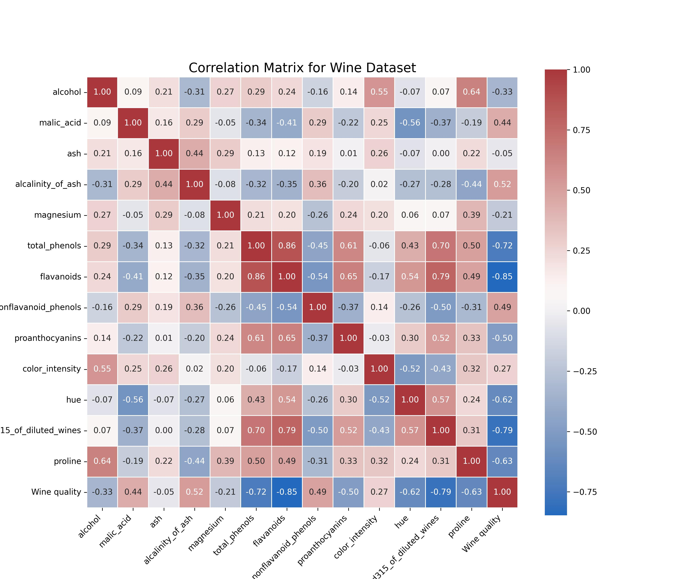
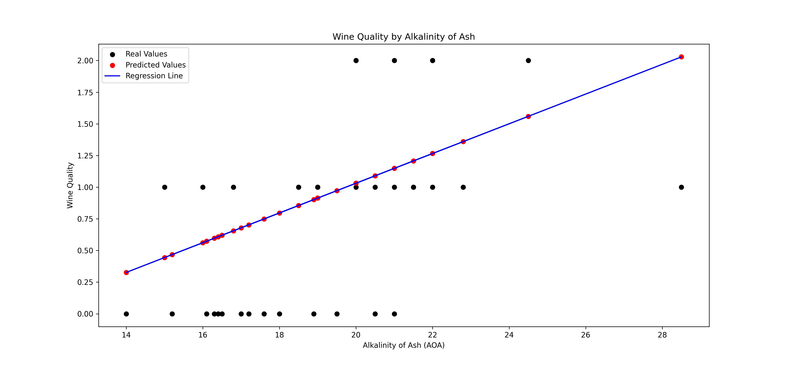

# Linear Regression Example: Alcohol Quality by Alkalinity of Ash

This repository demonstrates a basic implementation of simple linear regression to predict alcohol quality based on a specific chemical feature, "alkalinity of ash," from the Wine Dataset. The code visualizes the results using scatter plots for both real and predicted values, along with the regression line.

## Code Explanation

The provided code performs the following steps:

### 1. Loading and Inspecting the Dataset

The Wine Dataset is loaded using `sklearn.datasets.load_wine`, which contains data on various chemical properties of wine, along with the target variable, which is the quality of the wine (discrete class).

The data is combined into a Pandas DataFrame, and an initial inspection of the dataset is performed using `.describe()` to provide summary statistics.

The dataset is then analyzed with a scatter matrix to explore potential relationships between various features. A correlation matrix is computed and displayed using a heatmap to highlight the strength of the relationships between the features.

### 2. Feature Selection and Data Preprocessing

A single feature ("alkalinity of ash") is selected for this simple linear regression. This feature is reshaped into a 2D array (`simple_x`) to fit the linear regression model.

The data is split into training and testing sets using `train_test_split` from `sklearn.model_selection`, where 80% of the data is used for training and 20% is reserved for testing.

### 3. Training the Linear Regression Model

A Linear Regression model is created and trained using the `fit` method on the training data. Predictions for the test data are made using the `predict` method.

### 4. Plotting the Results

The results are visualized using `matplotlib` by plotting the real values (black) and predicted values (red) against the test set.

The regression line (blue) is also drawn to show the fitted relationship between the selected feature ("alkalinity of ash") and the target variable (wine quality).

### 5. Code

```python
import numpy as np
import pandas as pd
import seaborn as sns
from sklearn.linear_model import LinearRegression
from sklearn import datasets

# Loading the dataset
dataset = datasets.load_wine(as_frame=True)

# Setting data and target
x, y = dataset.data, dataset.target

# Creating dataframe
data = pd.concat([x, y], axis=1)

# Inspecting dataset
sample_indices = np.linspace(0, len(x) - 4, 4, dtype=int)
sample_indices = [index for i in sample_indices for index in range(i, i + 4)]
sample_indices = sample_indices[:len(x)]  # Ensure indices do not go out of bounds

sample_data = data.iloc[sample_indices, :]
styled_data = sample_data.style.set_properties(**{
    "text-align": "center",
}).set_properties(**{
    "border-left": "4px solid black"
}, subset=['target']).set_table_styles([dict(selector="th", props=[("font-size", "13px")]), 
                                          dict(selector="td", props=[("font-size", "11px")])]).background_gradient()

styled_data.to_html('styled_output.html')
pd.set_option('float_format', '{:g}'.format)
data.describe()

# Scatter matrix plot and correlation heatmap
axes = pd.plotting.scatter_matrix(data, figsize=(15, 15))

correlation_matrix = np.corrcoef(data.values.T)
fig, ax = plt.subplots(figsize=(8, 8))
tick_labels = list(x.columns) + ['diabetes']
hm = sns.heatmap(correlation_matrix, ax=ax, cbar=True, cmap="vlag", vmin=-1, vmax=1, annot=True, fmt='.2f', annot_kws={'size': 12}, xticklabels=tick_labels, yticklabels=tick_labels)
plt.tight_layout()

# Train-test split for simple linear regression
simple_x = x.alcalinity_of_ash.to_numpy().reshape(len(x), 1)
simple_x_train, simple_x_test, y_train, y_test = train_test_split(simple_x, y, random_state=0, test_size=0.2)

# Fit model
model = LinearRegression()
model.fit(simple_x_train, y_train)
simple_y_pred = model.predict(simple_x_test)

# Plot results
fig, ax = plt.subplots(figsize=(15, 7))

# Plot real values scatter plot
_ = plt.scatter(simple_x_test, y_test, color="black", label="Real Values")

# Plot predicted values scatter plot
_ = plt.scatter(simple_x_test, simple_y_pred, color="red", label="Predicted Values")

# Plot regression line
_ = plt.plot(simple_x_test, simple_y_pred, color="blue", label="Regression Line")

# Show legend
_ = plt.legend()

# Set title
title = "Alcohol Quality by Alkalinity of Ash"
plt.title(title)

# Set axis labels
ax.set_xlabel("Alkalinity of Ash (AOA)")
_ = ax.set_ylabel("Alcohol Quality (AQ)")

plt.show()
```
## Representations

Below are the visualizations generated from the model:

### 1. Scatter Matrix


### 2. Correlation Matrix



### 3. Linear Regression Results


